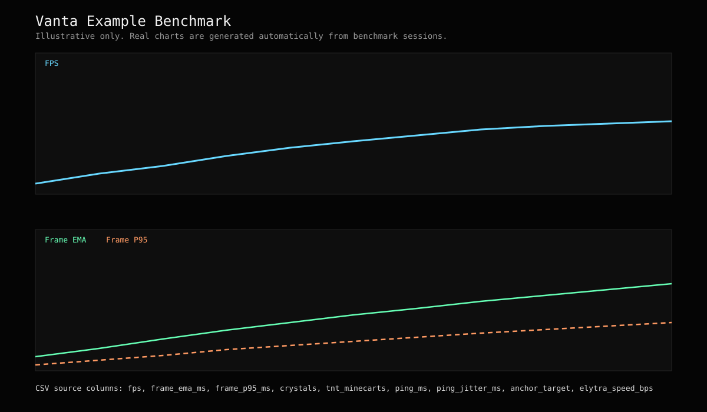

# Vanta

Vanta is a client-side Fabric PvP optimization mod focused on combat responsiveness, visual clarity, and frametime stability.

Vanta now runs in fully automatic background mode: no HUD, no hotkeys, no settings setup.


## v1 Modules

- Crystal optimizer: nearby crystal density tracking, nearest crystal distance, dense-fight render culling.
- TNT minecart optimizer: nearby TNT minecart density tracking, nearest distance visibility, dense-fight render culling.
- Ping optimizer: tracks live latency and jitter, then adapts combat-load behavior to reduce perceived delay spikes without packet abuse.
- Anchor optimizer: crosshair anchor state and charge readout with distance.
- Shield optimizer: offhand shield state, cooldown percent, block-hold timing.
- Elytra optimizer: total speed, horizontal speed, pitch, and durability telemetry.
- Combat-load performance: rolling frametime EMA and p95, particle budget, sound dedupe.

## Automatic Operation

- Vanta initializes automatically on client launch.
- Optimization modules run continuously in background with internal defaults.
- No UI toggles are required.
- No config setup is required.

## Legitimacy Boundary

- No combat automation.
- No aura, triggerbot, auto-clicking, auto-shield, or auto inventory behavior.
- No packet exploit or bypass logic.
- Ping optimization is adaptive client-side smoothing and load management only; it does not fake lower RTT.

## Internal Tuning Profile

- Vanta boots with a fixed competitive internal profile.
- Tuning is automatic and background-driven; there is no user profile switching.

## Benchmark Export

- Benchmark samples are written to `config/vanta-benchmarks/`.
- Benchmark capture starts automatically when entering a world and exports automatically when leaving.
- Every benchmark export writes both CSV and SVG.
- CSV includes FPS, frametime EMA, frametime p95, crystal count, TNT minecart count, ping, ping jitter, anchor focus, elytra speed, and high-load state.
- SVG charts are generated with FPS/frametime trends and ping summary metrics.

Example benchmark SVG:



## Naming and Versioning

- Semantic versioning is used for mod releases.
- Release tags follow: `v{mod_version}-mc{minecraft_version}`.
- Artifact name base includes Minecraft target: `vanta-mc{minecraft_version}`.
- Full scheme details: [VERSIONING.md](VERSIONING.md).

## GitHub Automation

- CI build workflow: `.github/workflows/ci.yml`
- Release workflow (tag-driven): `.github/workflows/release.yml`
- Benchmark SVG artifact preview workflow: `.github/workflows/benchmark-preview.yml`
- Issue templates and PR template are included under `.github/`.

## Stack

- Minecraft 1.21.11
- Fabric Loader 0.18.6
- Fabric API 0.141.3+1.21.11
- Java 21

## Build

```powershell
./gradlew.bat build
```

## Run Client

```powershell
./gradlew.bat runClient
```
